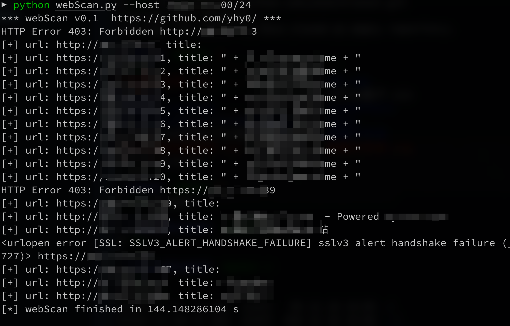

## Arsenal

### webScan

 用于内网web服务探测(80、443端口)，使用python2内置模块编写，无需其它依赖。

 探测一个C段大约2分半左右。

#### 使用

python webScan.py --host xxx.xxx.xxx.xxx/24

python webScan.py --host xxx.xxx.xxx.xxx

## 📜免责声明

本工具仅能在取得足够合法授权的企业安全建设中使用，在使用本工具过程中，您应确保自己所有行为符合当地的法律法规。 如您在使用本工具的过程中存在任何非法行为，您将自行承担所有后果，本工具所有开发者和所有贡献者不承担任何法律及连带责任。 除非您已充分阅读、完全理解并接受本协议所有条款，否则，请您不要安装并使用本工具。 您的使用行为或者您以其他任何明示或者默示方式表示接受本协议的，即视为您已阅读并同意本协议的约束。